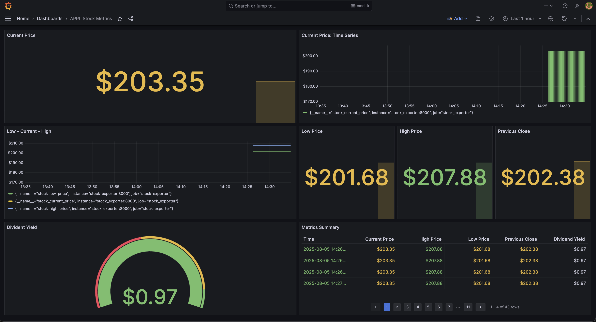
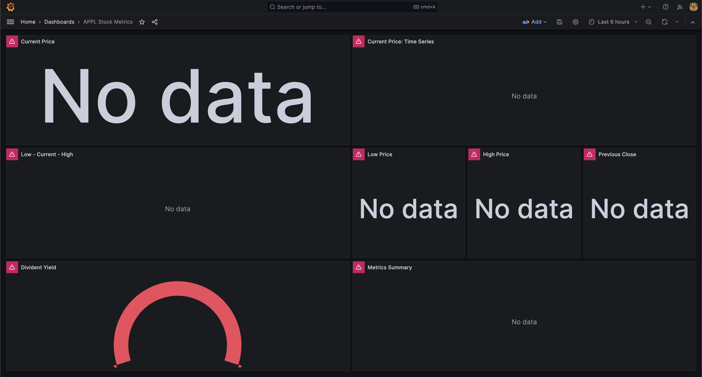
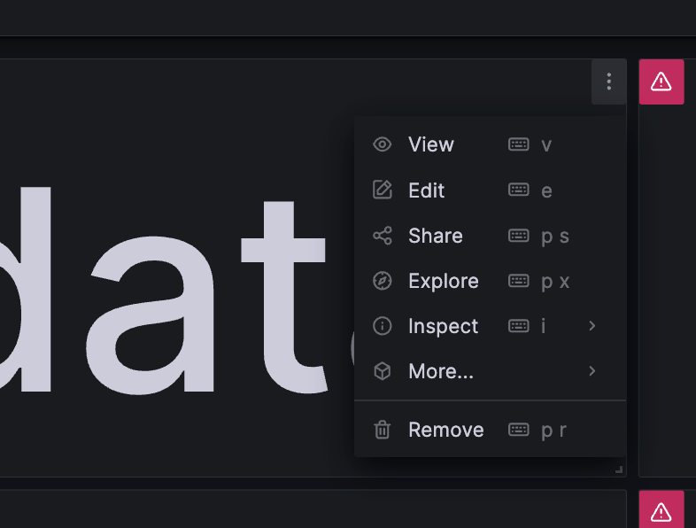
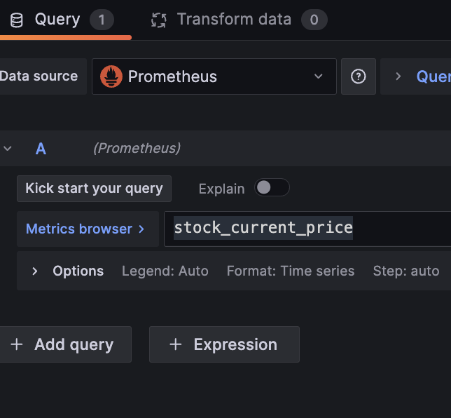
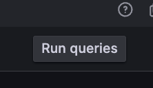
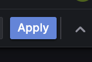

# Stock Dashboard with Grafana, Prometheus & Finnhub

This project is a real-time stock dashboard using **Grafana**, **Prometheus**, and the **Finnhub API**. It fetches live APPL stock price and visualizes them in a modern dashboard.



---

## Contents

- [Architecture Overview](#architecture-overview)
- [Technical Approach](#technical-approach)
- [Getting A FinnHub API Key](#getting-a-finnhub-api-key)
- [Setting Up Environment Variables](#setting-up-environment-variables)
- [Setup Instructions](#setup-instructions) *
- [Adding Grafana Dashboards](#adding-grafana-dashboards) *
- [File Structure](#file-structure)
- [Security Note](#security-note)
- [Trouble Shooting](#troubleshooting)
- [Future Enhancements](#future-enhancements)

\*Go directly to these sections to get started once you have your Docker, FinnHub and environment variables set up

---

## Architecture Overview

- **Finnhub API**: Provides real-time stock prices.
- **Python Exporter**: Fetches stock data and exposes it in Prometheus format.
- **Prometheus**: Scrapes metrics from the exporter.
- **Grafana**: Visualizes the data with custom dashboards.
- **Docker Compose**: Manages all services in isolated containers.

> **Note:**  
> This project requires [Docker Desktop](https://www.docker.com/products/docker-desktop/) to be installed and running on your computer.  
> Please install Docker Desktop before proceeding with the setup instructions below.

---

## Technical Approach

This project is a full-stack, containerized monitoring application that fetches real-time stock prices and visualizes them in Grafana dashboards. It leverages Python, Prometheus, and Grafana, all orchestrated with Docker Compose for easy deployment and reproducibility.

### Data Flow

1. **Stock Exporter**: A Python service fetches real-time stock prices from the Finnhub API and exposes them as Prometheus-compatible metrics.
2. **Prometheus**: Periodically scrapes metrics from the stock exporter and stores time-series data.
3. **Grafana**: Connects to Prometheus as a data source and visualizes the metrics in a customizable dashboard.

### Grafana Provisioning

To streamline dashboard setup and avoid manual configuration, Grafana uses **provisioning**:

- A YAML config file (`grafana/provisioning/dashboards.yml`) tells Grafana where to find prebuilt dashboards.
- The dashboard JSON (`grafana/dashboards/stock_dashboard.json`) is automatically loaded on startup.
- This ensures consistent visualization across environments and simplifies version control.

### Data Persistence

Grafana's internal data (e.g., user settings, installed plugins) is stored in a **named Docker volume** (`grafana-data`). This allows:

- Dashboards and configurations to persist across container restarts.
- Easy backup and migration of Grafana state.

### Docker Integration

All services are orchestrated using Docker Compose:

- Prometheus and Grafana use official Docker images.
- The stock exporter is built from a custom Dockerfile.
- Environment variables (like the Finnhub API key) are injected via Compose for secure configuration.

---

## Getting a Finnhub API Key

1. Go to [Finnhub.io](https://finnhub.io).
2. Click **Get Free API Key** and sign up for an account.
3. After verifying your email and logging in, navigate to your dashboard.
4. Copy your **API key** from the dashboard.

---

## Setting Up Environment Variables

The Python exporter requires your Finnhub API key and optionally a stock symbol.

### Using Docker Compose (recommended + supported)

Set environment variables directly in the `docker-compose.yml` file under the `stock_exporter` service:

```yaml
stock_exporter:
  build: ./stock_exporter
  ports:
    - '8000:8000'
  environment:
    - FINNHUB_API_KEY=your_finnhub_api_key
    - STOCK_SYMBOL=AAPL
```

**Note:** Never commit your API key to version control.

---

## Setup Instructions I

1. **Clone the Repository**

   ```bash
   git clone https://github.com/yourusername/stock_dashboard.git
   cd stock_dashboard
   ```

2. **Set Your Finnhub API Key**

   Follow the instructions above to set your `FINNHUB_API_KEY` and (optionally) `STOCK_SYMBOL`.

3. **Start the Stack**

   ```bash
   docker-compose up --build -d
   ```

   **_note_**

   - `-d` in the above command lets your stack run in the background so you can keep using your terminal
   - To stop and remove all containers and networks created by Compose, use this clean up command. Add `-v` at the end to delete volumes as well, otherwise, the Grafana volume will persist.

   ```bash
   docker-compose down
   ```

   This will start:

   - The Python stock exporter on port 8000
   - Prometheus on port 9090
   - Grafana on port 3000

4. **Access the Dashboards**

   - **Grafana:** [http://localhost:3000](http://localhost:3000)
   - **Prometheus:** [http://localhost:9090](http://localhost:9090)

5. **Add Grafana Dashboards**

   - Follow the steps in the next section to (1) add Prometheus as a data source, (2) import the prebuilt dashboard, and (3) troubleshoot data display by manually re-running queries on the dashboard panels.

---

## Setup Instructions II: Adding Grafana Dashboards

1. **Log in to Grafana on [http://localhost:3000](http://localhost:3000) (default user: `admin`, password: `admin`)**
2. **Add Prometheus as a data source**
   - Click **Connections** on the left of the dashboard
   - Add Prometheus as a data source by inputting (`http://prometheus:9090`)
3. **Import the Prebuilt Dashboard:**
   - Click **Dashboards** then **Create New Dashboard**
   - Select **Import**.
   - Upload the provided JSON file (`grafana/stock_dashboard.json`) from this repository, or paste its contents into the import box.
   - When prompted, select your Prometheus data source.
   - Click **Import** to finish.
4. **Re-establish Panel Connections:**
   - Open your dashboard in Grafana
   
   

   - Edit a panel by ***hovering*** over the top right corner

   

   - Click on the metric name field as if you were re-typing it (e.g. `stock_current_price`) in the query box

   

   - Click **Run query**, then **Apply**.

    
   


**Note:** Alternatively, Grafana metrics may take up to a minute to appear after startup. This delay is due to how the Python exporter script initializes and begins exposing metrics.

---

## File Structure

```
.
├── docker-compose.yml
├── prometheus.yml
├── README.md
├── stock_exporter/
│   ├── Dockerfile
│   ├── requirements.txt
│   └── stock_exporter.py
└── grafana/
    ├── dashboards/
    │   └── stock_dashboard.json
    └── provisioning/
        └── dashboards.yml
```

---

## Security Note

- **Never share your Finnhub API key publicly.**
- Use environment variables or Docker secrets for sensitive information.

---

## Troubleshooting

- If you see errors about missing API keys, ensure you have set `FINNHUB_API_KEY` in your environment or in `docker-compose.yml`.
- Check logs with `docker-compose logs stock_exporter` for more details.

> **If you see an error like:**  
> `Cannot connect to the Docker daemon at unix:///... Is the docker daemon running?`  
> **Solution:**  
> Make sure Docker Desktop is running on your computer. Open Docker Desktop from your Applications folder, wait for it to start, then try running `docker-compose up --`

---

## Future Enhancements

- **Grafana Alerts**: Add alert rules to notify when a stock price crosses a defined threshold (e.g., drops below a target value).
- **Contact Points**: Integrate notification channels such as:
  - **Slack**: Send real-time alerts to a Slack channel.
  - **Email**: Notify stakeholders via email when alerts are triggered.
- **Dashboard Customization**: Add support for multiple stock symbols and user-defined thresholds.
- **Exporter Improvements**: Optimize the Python exporter for faster metric availability and support additional financial indicators.

---
